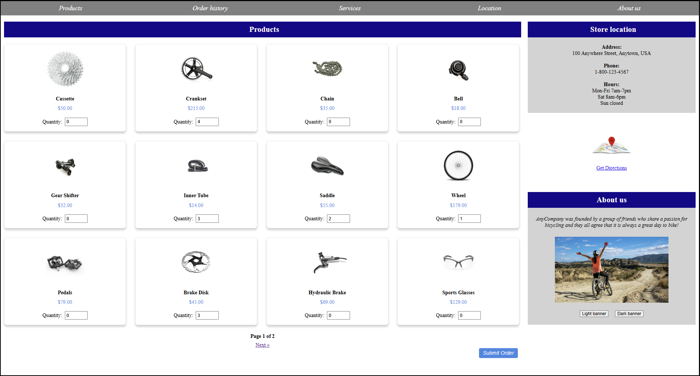

# AnyCompanyBicycleShop
# Django Bicycle Parts E-commerce Application

This project is a Django-based e-commerce application for selling bicycle parts. 

It provides functionality for managing products, orders, and customer interactions in a bicycle parts online store.

The application is designed to run on AWS infrastructure, utilizing services such as RDS for the database and S3 for static file storage.

## Repository Structure

```
django/
├── manage.py                     # Django management script
├── db.sqlite3                    # SQLite database (local development)
├── media/                        # Uploaded media files (for ImageField)
│   └── products/
│       ├── crankset.jpeg
│       └── wheel.jpeg
├── products.json                 # Fixture file for loading product data
├── requirements.txt
├── README.md

├── bicycle_app/                  # Your Django app
│   ├── migrations/
│   ├── static/                   # App-specific static files
│   │   ├── css/
│   │   │   ├── main.css
│   │   │   └── products.css
│   │   └── [optional: images, logos, etc.]
│   ├── templates/                # HTML templates
│   │   ├── index.html
│   │   ├── products.html
│   │   ├── order_result.html
│   │   ├── order_history.html
│   │   └── favicon.ico
│   ├── admin.py
│   ├── apps.py
│   ├── models.py
│   ├── urls.py
│   └── views.py

├── bicycle_project/              # Django project configuration
│   ├── __init__.py
│   ├── asgi.py
│   ├── settings.py
│   ├── urls.py
│   └── wsgi.py

└── .elasticbeanstalk/            # AWS deployment (optional)
```

### Key Files:
- `setup.sh`: Script for setting up the Django project and configuring the environment.

- `django/bicycle_project/settings.py`: Main Django settings file.

- `products.json`: Sample product data.

- `orders.json`: Sample order data.

- `order_details.json`: Sample order details data.

- `bicycle_app/`: Is the main Django app containing views, templates, static files, and models.

- `bicycle_project/`: contains core Django settings and URL routing.

- `Fixtures and media`: (e.g. product images) are stored under static/ for development.

- `Frontend assets (HTML, CSS)`: are separated cleanly from logic in views.py.

### Important Integration Points:
- **Database:** MySQL database hosted on Amazon RDS

- **Static Files:** Stored on Amazon S3

### Infrastructure

The application utilizes the following AWS resources:
- **EC2:** Hosts the Django application

- **RDS:** MySQL database for storing product and order information

- **S3:** Stores static files and media uploads

- **Elastic Beanstalk:** Manages the application deployment and scaling

## Architecture Diagram


This diagram illustrates the high-level architecture of the Django Bicycle Parts E-commerce Application. It shows how the different AWS services (EC2, RDS, S3, and Elastic Beanstalk) interact with the Django application to provide a scalable and robust e-commerce platform for selling bicycle parts. 


## Usage Instructions

## Installation

**Prerequisites:**
   - Python 3.10+
   - MySQL client libraries

1. Clone the repository

2. Run the setup script:
   ```
   ./setup.sh
   ```


**This script will:**
   - Create a virtual environment
   - Install Django and other dependencies
   - Set up the Django project structure
   - Configure the database connection

## Running the Application

1. Activate the virtual environment:
   ```
   source django/.venv/bin/activate
   ```

2. Change Directories:
   ```
   cd django
   ```
3. Run migrations:
   ```
   python manage.py migrate
   ```

4. Load sample data:
   ```
   python manage.py loaddata products.json orders.json order_details.json 
   ```

This will load:

products.json – Product catalog
orders.json – Order metadata
order_details.json – Line items for each order

**⚠️ If orders.json or order_details.json fail to load (e.g. due to model mismatches):** 
   - Ignore the error and proceed — products.json is the only required fixture for proper module loading. 
   - Once loaded, the application will automatically reflect this data in the interface and database.

5. Start the development server:
   ```
   python manage.py runserver
   ```

6. Access the application at `http://localhost:8000`

### The Website Loads With Product Fixtures:


- SQL query to verify the **Product Table** has loaded:
  ```
  $ sqlite3 db.sqlite3 "
  SELECT 
      id AS 'Product ID',
      product_name AS 'Name',
      description AS 'Description',
      printf('$%.2f', price) AS 'Price',
      product_group AS 'Group'
  FROM bicycle_app_product
  ORDER BY id;
  " | column -t -s '|'
  ```
  

## Accessing the Django Admin Console

**To manage your products, orders and users via Django’s built-in admin interface, follow these steps:**

1. Create a Superuser:
   - Run this from the `django/` directory
     ```
     python manage.py createsuperuser
     ```
   - You’ll be prompted to enter a username, email address and password.

2. Start the Development Server:
   ```
   python manage.py runserver
   ```

3. Sign In to the Admin Console:
   - Open your browser at
     http://localhost:8000/admin/

     

4. Once signed in, you’ll see the following sections in the admin dashboard:
     - **Authentication and Authorization**
        - **Groups**  — create, edit or delete user groups.
        - **Users**  — manage site users and their permissions.

     - **Bicycle_app**
        - **Order_items**  — view or add individual line‐items on orders. 
        - **Orders**  — browse, create and edit customer orders.
        - **Products**  — add, update or remove bicycle parts in your catalog.

     - **Recent actions**  — quick link to edits you’ve made most recently.

       

## Demo: Adding a Product via Admin (Rear Light)

1. Log in to the admin at `http://localhost:8000/admin/` with your superuser credentials.  

2. Under **Bicycle_app**, click **Products ➔ Add**  

3. Fill out the form:

   


4. Click **Save**.  

5. You’ll now see **“Rear Light”** listed under **Products** – you can click the **ID** number to edit it anytime.

   
   
---
> **Pro tip:** if you need to bulk-load this into your `products.json`, here’s a fixture snippet you can drop in and then run `loaddata products.json`:

```
{
  "model": "bicycle_app.product",
  "pk": 4,
  "fields": {
    "name": "Rear Light",
    "description": "High-intensity LED rear safety light for bicycles",
    "price": "19.99",
    "stock": 120,
    "image": "rear_light.jpg"
  }
}
```

## Product Ordering Flow (Demo)
1. *Visit the Products Page*
   - Navigate to / to browse a dynamic grid of bike-related products, each showing an image, name, price, and a quantity input.

2. *Select Quantities*
   - Users can enter desired quantities (0–4) for any products they wish to order. 
     
   - Fields are validated to prevent submitting an empty cart.
     
     

3. *Submit Order*
   - Click the Submit button at the bottom of the page. 

   - The form sends a POST request to the process_order view.
     

4. *Order Processing Logic*
   - Only non-zero quantity products are processed.

   - The server calculates individual line totals and an overall order amount.

   - A new Order and associated Order_Item records are created and stored in the database.
     

5. *Order Confirmation*
   - After successful processing, users are redirected to a confirmation page showing:
    - The full order history summary.

    - Each product ordered, quantity, and line total.

    - Total price for the order.
      


6. *Order History*
    - Visit /order_history/ to view a history of all previous orders stored in the system.
      

## Potential Implementations
**This Django-based bicycle shop is functional for demo and testing, but there are key opportunities to expand the project:**

- **User Features to Add:**
  - User Login/Register	Enable personal order history, authentication, and secure sessions

  - Shopping Cart Page	Allow users to build a cart before submitting, with item remove/edit

  - Stripe Integration	Add real payment processing using Stripe Checkout

  - Order Tracking View	Allow users to track past orders and print receipts

  - Image Previews	Add thumbnails in admin and checkout confirmation

  - Quantity Updates in Cart	Support dynamic quantity changes and real-time total updates

  - Email Order Receipt	Send confirmation emails using Django's email backend (SMTP)  
    
- **The AnyCompany Bicycle Shop application successfully demonstrates core e-commerce functionality using Django:**  
  - Dynamic product listing

  - Server-side order processing

  - Model relationships (Product → Order_Item → Order)

  - Admin-based inventory management

  - With additional layers like authentication, payment flow, and interactive cart features, this project can evolve into a robust, real-world shopping solution.

## AWS Deployment

This application is designed to be deployed on AWS Elastic Beanstalk and migrated to RDS as a database. 

(You can skip these steps if you would like to demo the application as a core django project.)

## Configuration
1. Update `django/bicycle_project/settings.py` with your specific settings:
   - Set `DATABASES` configuration to point to your RDS instance
   - Configure `AWS_STORAGE_BUCKET_NAME` and `AWS_S3_REGION_NAME` for S3 static file storage

2. Set up environment variables:
   - `AWS_ACCESS_KEY_ID`
   - `AWS_SECRET_ACCESS_KEY`
  
*Follow these steps:*
1. Install the Elastic Beanstalk CLI
 
2. Initialize your EB environment:
   ```
   eb init -p python-3.10 bicycle-parts-app
   ```
3. Create the environment:
   ```
   eb create bicycle-parts-env
   ```
4. Deploy your application:
   ```
   eb deploy
   ```

## Data Flow

1. User requests arrive at the Django application.

2. Django processes the request, interacting with the MySQL database on RDS as needed.
3. For product images and static files, Django interacts with the configured S3 bucket.
4. The response is generated and sent back to the user.

   ```
   [User] <-> [Django App] <-> [RDS MySQL]
                    ^
                    |
                    v
               [S3 Bucket]

